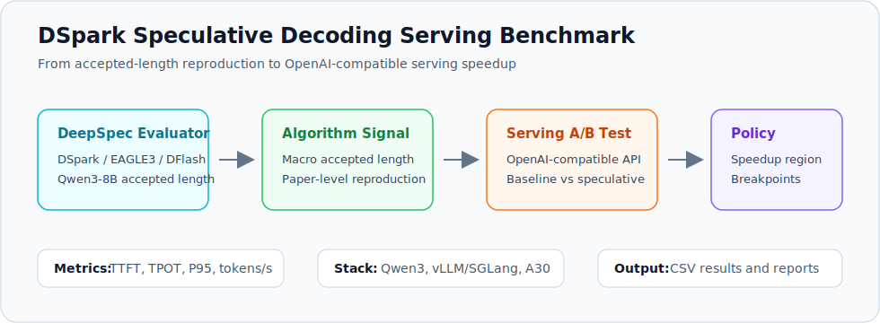
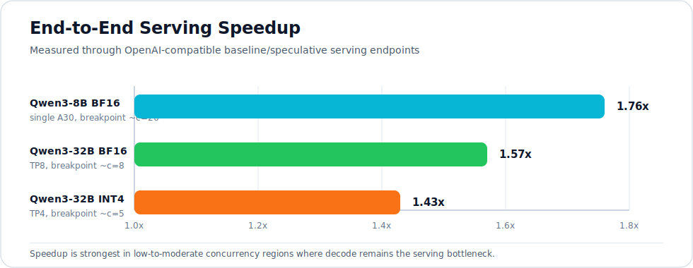

# DeepSeek DSpark Speculative Decoding Serving Benchmark

<p align="center">
  
</p>

<p align="center">
  <b>基于 DeepSeek DSpark 的 LLM 投机解码推理加速优化</b>
</p>

<p align="center">
  <a href="reports/dspark_reproduction.md">DSpark Reproduction</a> ·
  <a href="reports/serving_benchmark_report.md">Serving Benchmark</a> ·
  <a href="reports/deployment_notes.md">Deployment Notes</a> ·
  <a href="results/serving_speedup_summary.csv">Result CSV</a>
</p>

This repository evaluates DeepSeek DSpark-style speculative decoding as an
OpenAI-compatible LLM serving optimization. It connects paper-level
accepted-length reproduction with end-to-end serving benchmarks, so the project
answers a practical systems question:

> When does speculative decoding actually reduce wall-clock latency for an LLM
> service?

The project does **not** train a new draft model. It uses existing DSpark /
DeepSpec and supported draft-model serving paths to build a reproducible
benchmark, compare baseline vs speculative decoding, and derive deployment
rules.

## Highlights

| Area | What This Repository Provides |
| --- | --- |
| Algorithm validation | Reproduces DeepSpec DSpark / EAGLE3 / DFlash accepted length on Qwen3-8B |
| Serving benchmark | Runs OpenAI-compatible baseline/speculative endpoints with matched request shapes |
| Metrics | TTFT, TPOT, P95 latency, client tokens/s, engine throughput, accepted length |
| Systems analysis | Studies concurrency, tensor parallelism, quantization, draft overhead, and breakpoints |
| Outputs | Scripts, CSV results, reproduction reports, and deployment policy notes |

## Key Results

<p align="center">
  
</p>

### DeepSpec / DSpark Reproduction

On Qwen3-8B with official DeepSpec-style checkpoints:

| Metric | Result |
| --- | ---: |
| DSpark macro accepted length | 5.021 |
| DSpark vs EAGLE3 | +26.4% |
| DSpark vs DFlash | +18.6% |

The reproduced result is close to the paper-level claim:

| Comparison | Reproduced | Paper |
| --- | ---: | ---: |
| DSpark vs EAGLE3 | +26.4% | +26.7% |
| DSpark vs DFlash | +18.6% | +18.4% |

### OpenAI-Compatible Serving Speedup

The serving experiments compare target-only decoding with speculative decoding
under the same request shape.

| Configuration | c=1 Speedup | Breakpoint | Main Bottleneck |
| --- | ---: | ---: | --- |
| Qwen3-8B BF16, single A30 | 1.76x | ~c=26 | draft overhead and batching budget |
| Qwen3-32B BF16, TP8 | 1.57x | ~c=8 | tensor-parallel communication |
| Qwen3-32B INT4, TP4 | 1.43x | ~c=5 | quantization reduces decode bottleneck |

Main conclusion: speculative decoding should be treated as a
policy-controlled serving optimization. It is most useful for low-to-moderate
concurrency, long-output, domain-matched workloads where decode remains the
bottleneck.

## Methodology

The project is split into two stages.

| Stage | Purpose | Output |
| --- | --- | --- |
| A. DeepSpec reproduction | Validate DSpark-side accepted-length improvement against EAGLE3 and DFlash | `results/deepspec_qwen3_8b_acceptance.csv` |
| B. Serving A/B benchmark | Measure whether the algorithmic signal becomes wall-clock serving speedup | `results/serving_speedup_summary.csv` |

Serving benchmark shape:

```text
client
  -> /v1/chat/completions
  -> baseline endpoint: target model only
  -> spec endpoint: target model + draft model + speculative verification
  -> benchmark driver: latency, throughput, accepted length, backend metrics
```

This separates the algorithm metric, `accepted length`, from the serving metric,
`wall-clock latency and throughput`.

## Quick Start

### 1. Install Python dependencies

```bash
python3 -m venv .venv
source .venv/bin/activate
pip install -r requirements.txt
```

### 2. Reproduce DeepSpec accepted length

```bash
bash scripts/run_deepspec_eval_qwen3_8b.sh
```

Expected logs are written under:

```text
outputs/deepspec-runs/
```

### 3. Start a baseline serving endpoint

```bash
MODEL_PATH=/models/Qwen3-8B \
PORT=8550 \
TP=1 \
GPUS=0 \
bash scripts/run_vllm_baseline.sh
```

### 4. Start a speculative-decoding endpoint

```bash
MODEL_PATH=/models/Qwen3-8B \
DRAFT_MODEL_PATH=/models/Qwen3-8B_eagle3_angelslim \
PORT=8550 \
TP=1 \
GPUS=0 \
SPEC_TOKENS=4 \
bash scripts/run_vllm_spec.sh
```

### 5. Run the concurrency ladder

```bash
python3 benchmark/spec_decode_microbench.py \
  --tag qwen3_8b_spec \
  --base-url http://127.0.0.1:8550/v1 \
  --out-dir outputs/qwen3_8b_spec \
  --concurrencies 1,2,4,8,16,24,32 \
  --max-tokens 256 \
  --ignore-eos
```

The driver writes per-request JSONL, sampled backend metrics, and a compact
`ladder.csv` summary under the selected output directory.

## Repository Layout

```text
.
├── assets/
│   ├── overview.svg
│   └── speedup_summary.svg
├── benchmark/
│   └── spec_decode_microbench.py
├── configs/
│   └── qwen3_spec_benchmark.env.example
├── reports/
│   ├── deployment_notes.md
│   ├── dspark_reproduction.md
│   └── serving_benchmark_report.md
├── results/
│   ├── deepspec_qwen3_8b_acceptance.csv
│   └── serving_speedup_summary.csv
└── scripts/
    ├── run_decode_ladder.sh
    ├── run_deepspec_eval_qwen3_8b.sh
    ├── run_vllm_baseline.sh
    └── run_vllm_spec.sh
```

## Hardware and Runtime

Original experiments were run on:

- 8x NVIDIA A30 24GB
- Qwen3-8B and Qwen3-32B target models
- DSpark / DFlash / EAGLE3 official or open checkpoints
- vLLM / SGLang OpenAI-compatible serving interfaces

The scripts are parameterized through environment variables so the benchmark
can be rerun on different GPU topologies, model paths, and serving backends.

## Reports

- [DSpark reproduction report](reports/dspark_reproduction.md)
- [OpenAI-compatible serving benchmark report](reports/serving_benchmark_report.md)
- [Deployment notes](reports/deployment_notes.md)

## Scope and Limitations

This repository does not claim that DSpark itself is fully integrated into vLLM
serving. DSpark is used as the DeepSpec algorithm baseline and reproduction
target. The end-to-end serving experiments use draft-model paths supported by
the tested OpenAI-compatible serving stack.

This distinction is intentional: it separates the algorithm question
(`accepted length`) from the serving question (`wall-clock latency and
throughput`), which is the core systems problem the project evaluates.

