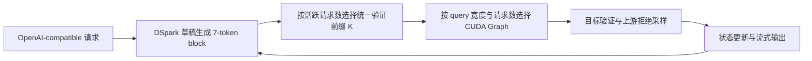

# DSpark Speculative Decoding Serving Benchmark

<p align="center">
  
</p>

<p align="center">
  <b>基于 DSpark 的多卡大模型推理加速与 vLLM 调度优化</b>
</p>

<p align="center">
  <a href="#加速结果">加速结果</a> ·
  <a href="#核心实现">核心实现</a> ·
  <a href="#快速开始">快速开始</a> ·
  <a href="benchmark/qwen38_multigpu/README.md">复现指南</a> ·
  <a href="#实验与文档">实验报告</a>
</p>

基于 vLLM 接入 DSpark 投机解码，研究草稿接受收益如何转化为真实服务加速，并针对高并发下的验证与调度开销实现框架优化。

核心实验面向包含 **Gated DeltaNet（GDN）** 的混合注意力模型，在 **4×NVIDIA A30、TP4** 上部署 **Qwen3.8-27B BF16 + 匹配的 DSpark 草稿模型**：低并发生成吞吐达到自回归基线的 **2.43×**；通过统一验证预算与 CUDA Graph 分档，在并发 4 / 16 下较原始 DSpark 策略再提升 **6.3% / 7.8%**。

## 项目目标

投机解码用草稿模型提出多个候选 token，再由目标模型一次验证，以减少串行 decode 轮次。服务端收益同时取决于接受长度、验证成本、缓存容量、请求排队与图捕获形状。

本项目围绕三个问题展开：

- **接入能带来多少加速？** 在固定模型、输入输出长度和缓存预算下，对比自回归与投机解码的端到端吞吐、TTFT 和 TPOT。
- **为什么高并发收益会收窄？** 结合 Nsight、调度 Trace 和真实缓存分配记录，检查验证开销、CUDA Graph padding 与 GDN 状态容量。
- **框架层还能改进什么？** 按活跃 batch 选择验证预算，细分图捕获形状，并用独立对照和消融验证增量。

模型权重、草稿算法、拒绝采样和 GDN 状态管理采用上游实现；本仓库的开发工作集中在调度适配、图捕获、性能评测与数值诊断。

## 加速结果

### DSpark 接入收益

目标模型 Qwen3.8-27B，匹配草稿约 **1.99B 参数**。实验使用 vLLM **0.29.0**、4×A30 TP4、约 **2K 输入 / 256 实际输出 token**，每卡缓存预算 **4.5 GiB**；冻结同一组公开 ShareGPT 负载，进行五轮配对测试。

<p align="center">
  
</p>

| 请求并发 | 原生 DSpark / 自回归吞吐 | 客户端 TPOT 降幅 |
| ---: | ---: | ---: |
| 1 | **2.433×** | **63.9%** |
| 4 | **1.688×** | **55.9%** |
| 16 | 0.898× | 27.3% |

低并发下，减少目标模型串行执行轮次带来明显加速；并发 16 时，接受长度更高，整体吞吐却低于自回归，说明接受率之外的系统开销需要单独分析。

### 调度与图捕获优化增量

<p align="center">
  
</p>

| 对比 | 并发 | 五轮配对吞吐变化 |
| --- | ---: | ---: |
| 验证预算 + 图分档 / 原始 DSpark 策略 | 4 | **+6.3%** |
| 验证预算 + 图分档 / 原始 DSpark 策略 | 16 | **+7.8%** |
| 仅图分档 / 原始 DSpark 策略 | 16 | +0.9% |
| 验证预算 + 图分档 / 仅图分档 | 16 | +8.2% |

图分档将目标 **padding 比（捕获 token / 有效 token）从 1.41 降至 1.09**；预算与图分档组合的比例约为 1.10。padding 是形状计数，不能直接解释成 GPU 耗时降幅。

并发 4 的增量来自冻结策略的独立验证集消融；并发 16 来自 AR / 原始策略 / 仅图分档 / 组合方案的五轮直接对照，三个 DSpark 版本共用一个扩展图池。在这个直接对照中，原始策略 / AR 为 **0.931×**，组合方案 / AR 为 **0.995×**（五轮范围 **0.974–1.016×**），吞吐基本持平，客户端 TPOT 降低 **40.6%**。

这些结果表示优化收窄了高并发吞吐差距。统计采用**同轮比值的中位数**；不同实验的数字不能拼接，逐级消融的中位数也不能相加或相乘。详细数据见[接入与消融报告](reports/qwen38_dspark_tp4_20261003.md)和[直接对照报告](reports/qwen38_dspark_closure_20261003.md)。

## 核心实现

<details>
<summary>投机解码执行路径</summary>


```mermaid
flowchart LR
    A[OpenAI-compatible 请求] --> B[DSpark 草稿生成 7-token block]
    B --> C[按活跃请求数选择统一验证前缀 K]
    C --> D[按 query 宽度与请求数选择 CUDA Graph]
    D --> E[目标验证与上游拒绝采样]
    E --> F[状态更新与流式输出]
    F --> B
```

</details>

### 统一验证预算

[`uniform_budget.py`](benchmark/qwen38_multigpu/uniform_budget.py) 扩展 vLLM V1 AsyncScheduler，根据当前活跃请求数，从冻结的校准表选择统一验证前缀 K。

草稿仍生成完整的 7-token block，调度器缩短提交给目标模型的验证前缀，权衡单轮验证成本与可接受 token 数。异步共享占位列表通过切片复制处理，后续拒绝采样和状态生命周期沿用 vLLM。

校准与验证使用不同提示词；策略保存在 [`qwen38_uniform_budget.json`](configs/qwen38_uniform_budget.json)，验证过程中保持冻结。这是在单个 DSpark 引擎内调整验证长度的策略。

### CUDA Graph 分档

[`uniform_graphs.py`](benchmark/qwen38_multigpu/uniform_graphs.py) 按目标 query 宽度 **2 / 3 / 5 / 8** 和请求数构建图桶，为草稿保留宽度 **7** 的图捕获路径，并加入 **6 / 12 / 24** 请求桶，减少有效 batch 与捕获形状之间的补齐。

[`check_graphs.py`](benchmark/qwen38_multigpu/check_graphs.py) 检查实际 vLLM 图分派覆盖；[`threeway.py`](benchmark/qwen38_multigpu/threeway.py) 在共同的 45 图池内随机比较原始策略、仅图分档和预算 + 图分档，使图池资源成本保持一致。预算的 +8.2% 是相对完成图适配的版本的收益。

### 容量与数值诊断

[`admission_audit.py`](benchmark/qwen38_multigpu/admission_audit.py) 和 [`capacity_probe.py`](benchmark/qwen38_multigpu/capacity_probe.py) 观察真实缓存申请及返回值。同一字节预算下，DSpark 的 GDN 缓存组每请求申请 8 个状态块，自回归申请 1 个；记录到一次需要 95 块、空闲仅 88 块而推迟请求准入，其中 80 块属于 GDN 状态。这确认状态容量会造成排队，尚未量化它占全部性能损失的比例。

[`decision_audit.py`](benchmark/qwen38_multigpu/decision_audit.py) 对齐实际 HTTP token IDs、目标 logits、argmax 与四个 TP rank 的输出。**13,056 个实际输出决策符合各自目标 argmax**；所查长序列首分歧对应同一前缀下 BF16 logits 排序变化，普通自回归的串行 / 并发对照也出现类似变化。固定 16 个短任务、自然 EOS 和显式 stop 检查通过；长序列仍存在差异，未证明普遍逐 token 一致。

Nsight、缓存与数值探针单独运行，诊断开销不计入性能结果。阶段标记和分析工具见 [`phases.py`](benchmark/qwen38_multigpu/phases.py)、[`capture_profile.py`](benchmark/qwen38_multigpu/capture_profile.py) 与 [`analyze_profile.py`](benchmark/qwen38_multigpu/analyze_profile.py)。

## 快速开始

### 不用 GPU，复核已有结果

从仓库根目录运行，仅需 Python 标准库：

```bash
python3 benchmark/qwen38_multigpu/reproduce_results.py \
  --output outputs/qwen38-evidence
```

脚本核对 **27 个压缩原始档案**及解压后的 SHA-256，重新计算**四份汇总**并与提交结果比较，同时检查 13,056 个输出决策。输出目录必须为空，重复执行请使用新的路径。

原始请求、调度与诊断记录保存在 [`results/qwen38_multigpu_20261003`](results/qwen38_multigpu_20261003)；[`bundle-manifest.json`](results/qwen38_multigpu_20261003/bundle-manifest.json) 记录数据、冻结负载、策略和源码哈希。仓库保存可重新分析的数据，不包含模型权重或大型 Nsight 数据库。

### 使用 GPU 重新实验

先按[完整复现指南](benchmark/qwen38_multigpu/README.md#gpu-实验环境)准备固定 revision 的目标模型、草稿配置与 tokenizer，并选择四张空闲 GPU。独立环境依赖见 [`requirements.txt`](benchmark/qwen38_multigpu/requirements.txt)。

```bash
python3 -m venv benchmark/qwen38_multigpu/.venv
source benchmark/qwen38_multigpu/.venv/bin/activate
python -m pip install -r benchmark/qwen38_multigpu/requirements.txt

export DSPARK_MODEL=/absolute/path/Qwen3.8-27B
export DSPARK_DRAFT_MODEL=/absolute/path/Qwen3.8-27B-speculator.dspark
export DSPARK_GPUS=0,1,2,3  # 替换为自己的四张空闲卡

# 草稿配置和 tokenizer 准备好后，下载并校验固定草稿权重
python benchmark/qwen38_multigpu/download_draft.py

# 自回归 / 原生 DSpark 五轮配对对照
python benchmark/qwen38_multigpu/run.py \
  --gpus "$DSPARK_GPUS" --output outputs/qwen38-native.json \
  --modes ar,fixed --rounds 5 --concurrency 1,4,16 \
  --requests 4 --tokens 256 --kv-gib 4.5 --sample-offset 16
python benchmark/qwen38_multigpu/summarize.py outputs/qwen38-native.json
```

预算校准、独立验证集消融、并发 16 直接对照及容量诊断的完整命令见[复现步骤](benchmark/qwen38_multigpu/README.md#复现步骤)。启动器检查 GPU 显存和实际计算进程，通过文件锁避免重复实验，只停止自己创建的服务进程。

## 实验与文档

仓库从算法接受长度、服务端加速到框架优化形成一条验证链。下表按实验问题组织；各模型、草稿、精度与运行时的结果分别记录。

<p align="center">
  
</p>

上图展示 **Qwen3 / EAGLE3** 在并发 1 下的单独评测，用于比较 TP 和量化配置的收益边界；Qwen3.8 / DSpark 的主实验结果见上方。

| 实验 | 覆盖与用途 | 文档 |
| --- | --- | --- |
| 混合注意力模型多卡加速 | Qwen3.8-27B BF16 + 匹配 DSpark，4×A30 TP4；接入、验证预算和图捕获优化 | [实验与消融](reports/qwen38_dspark_tp4_20261003.md) / [直接对照与诊断](reports/qwen38_dspark_closure_20261003.md) |
| DSpark / DeepSpec 接受长度复现 | Qwen3-8B，八数据集宏平均接受长度 5.021；对照 EAGLE3 与 DFlash | [复现报告](reports/dspark_reproduction.md) |
| 原生 DSpark 服务验证 | vLLM 0.26.0、Qwen3-8B BF16、单 A30；并发 1 / 4 / 16 吞吐为 AR 的 2.05× / 1.89× / 1.61× | [服务验证](reports/vllm026_dspark_serving_validation.md) |
| TP 与量化的收益边界 | Qwen3-8B 单卡、Qwen3-32B BF16 TP8 / INT4 TP4，使用 EAGLE3 草稿比较并发拐点 | [服务评测](reports/serving_benchmark_report.md) |
| 跨目标草稿压力测试 | 32B 目标接入 14B DSpark 草稿，研究模型不匹配、量化与并发影响 | [压力测试](reports/vllm026_dspark_32b_cross_target.md) |
| 自回归 / 投机后端路由 | 从对应并发梯度 CSV 拟合阈值，并离线回放路由决策 | [路由策略](reports/adaptive_policy.md) |

EAGLE3 服务评测和跨目标草稿压力测试有各自的实验条件。路由模块在自回归与投机后端之间选择；Qwen3.8 的统一预算模块在投机引擎内部选择验证前缀，两者实现与验证范围分别记录，目前没有接入 Qwen3.8 自动自回归回退。

部署信息见[部署说明](reports/deployment_notes.md)，项目讲解见[面试材料](reports/qwen38_dspark_interview.md)。

## 测量口径与适用范围

- **吞吐**按实际输出 token 总数除以有限请求组完成时间计算；这是 closed-loop 请求组测试。**TPOT**按首尾非空 SSE 到达间隔除以实际输出 token 数减一计算，包含调度与流式交付，SSE chunk 数不当作 token 数。
- **配对控制**固定负载、缓存预算和输出长度，关闭 thinking / prefix cache，性能测试忽略 EOS；模型加载、预热、图捕获和诊断位于计时之外。正确性测试另行检查自然 EOS / stop。
- **硬件范围**为 PCIe A30。Qwen3.8 主实验使用四张卡、PHB / PIX 混合拓扑，无 NVLink；匹配草稿有 20 个 attention heads，未测 TP8。32B TP8 结果来自表中单独的 Qwen3 实验。
- **优化边界**为固定 vLLM 0.29.0 内部接口和校准负载。最大 K=7 仍配置 8 个 GDN 状态块，缩短实际验证前缀没有缩小预分配状态容量；更换模型、拓扑、并发与缓存预算需重新评测。

## 目录结构

```text
benchmark/
  qwen38_multigpu/          # 多卡服务、预算 / 图适配、诊断与结果复核
  spec_decode_microbench.py # OpenAI-compatible 并发梯度评测
  adaptive_policy.py       # 自回归 / 投机后端选择
  fit_adaptive_policy.py   # 从测量 CSV 拟合路由阈值
  simulate_adaptive_policy.py
configs/                   # 冻结预算策略、后端路由与环境配置
results/
  qwen38_multigpu_20261003/ # 原始档案、四份汇总与 SHA-256 清单
  *.csv                    # 各模型 / 草稿组合的评测数据
reports/                   # 算法复现、服务评测、消融与诊断报告
scripts/                   # DeepSpec 与 Qwen3 服务实验启动脚本
```

<details>
<summary>重新生成 README 图表</summary>

图表沿用统一的卡片与配色风格，性能数值直接读取仓库中的 JSON / CSV 结果。

```bash
python3 -m pip install -r assets/requirements.txt
python3 assets/generate_readme_figures.py
```

</details>
