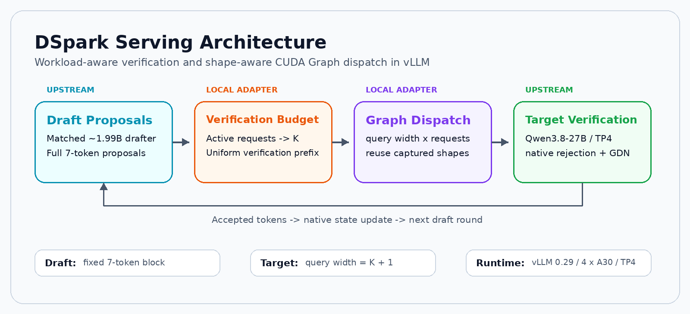
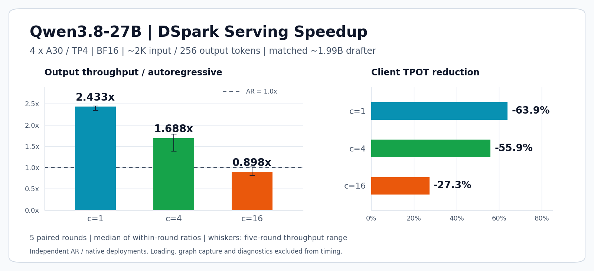
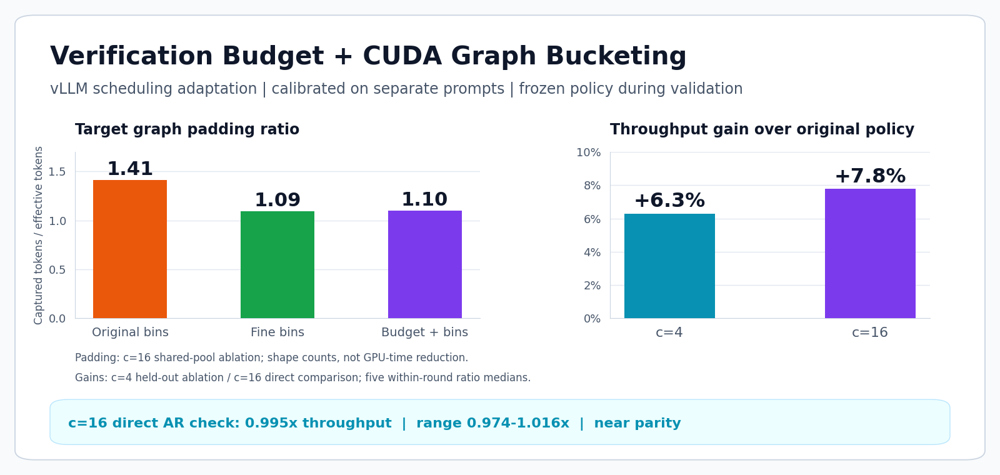
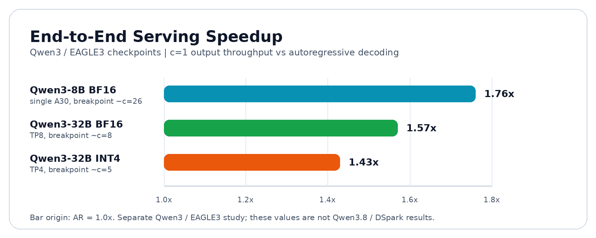

# DSpark 多卡推理加速

<p align="center">
  <b>基于 vLLM，为 DSpark 推理实现按负载选择的验证预算与 CUDA Graph 分档。</b>
</p>

<p align="center">
  <a href="README.md">English</a> · <b>简体中文</b>
</p>

<p align="center">
  <a href="#核心能力">核心能力</a> ·
  <a href="#架构">架构</a> ·
  <a href="#性能结果">性能结果</a> ·
  <a href="#快速开始">快速开始</a> ·
  <a href="benchmark/qwen38_multigpu/README.zh-CN.md">复现指南</a>
</p>

## 项目介绍

本项目基于 vLLM 接入多卡 DSpark 投机解码，实现**验证预算调度**和**按形状选择 CUDA Graph**，通过配对压测评估这些改动对服务吞吐和 token 延迟的影响。

主实验在 **4×NVIDIA A30、TP4** 上部署 **Qwen3.8-27B BF16 + 匹配的约 1.99B DSpark 草稿模型**。目标模型采用混合注意力，包含 Gated DeltaNet（GDN）层。

## 核心能力

- **按负载选择验证预算：** 根据实际活跃请求数，从冻结的校准策略中选择统一验证前缀，草稿保持完整的 7-token block。[调度适配代码](benchmark/qwen38_multigpu/uniform_budget.py)
- **按形状分档 CUDA Graph：** 按目标 query 宽度和请求数选择图桶，减少验证补齐，同时保留草稿图捕获路径。[图适配代码](benchmark/qwen38_multigpu/uniform_graphs.py)
- **多卡对照与归因：** 随机配对比较 AR、原始 DSpark、仅图分档和组合方案；容量与目标输出决策诊断单独采集。[实验驱动](benchmark/qwen38_multigpu/threeway.py)

## 架构

<p align="center">
  
</p>

两处本地适配分别控制**目标模型验证多少候选 token**和**使用哪个已捕获的执行形状**。模型权重、拒绝采样和 GDN 状态管理采用上游实现。

## 性能结果

**条件：** vLLM 0.29.0 · 4×A30 TP4 · BF16 · 约 2K 输入 / 256 输出 token · 每卡 4.5 GiB 缓存预算 · 五轮配对测试。

### 原生 DSpark 对比自回归

<p align="center">
  
</p>

### 验证预算与图分档优化

<p align="center">
  
</p>

框架优化的增量以**原始 DSpark 策略**为基线。并发 16 下，组合方案吞吐与 AR **基本持平**，尚未取得稳定吞吐加速。[消融与直接对照](reports/qwen38_dspark_closure_20261003.md)

<details>
<summary>数值结果与对比口径</summary>

| 实验 | 并发 | 对比 | 吞吐 | 客户端 TPOT 降幅 |
| --- | ---: | --- | ---: | ---: |
| 独立部署 | 1 | 原生 DSpark / AR | **2.433×** | **63.9%** |
| 独立部署 | 4 | 原生 DSpark / AR | **1.688×** | **55.9%** |
| 独立部署 | 16 | 原生 DSpark / AR | 0.898× | 27.3% |
| 独立验证集消融 | 4 | 预算 + 图分档 / 原始策略 | **+6.3%** | — |
| 同图池直接对照 | 16 | 预算 + 图分档 / 原始策略 | **+7.8%** | — |
| 同图池直接对照 | 16 | 预算 + 图分档 / AR | **0.995×** | **40.6%** |

- 数值采用五轮**同轮比值的中位数**。独立部署与同图池消融的条件不同，需要分别解释。
- 并发 16 相对 AR 的五轮吞吐范围为 **0.974–1.016×**。仅图分档的 padding 比为 **1.09**，组合方案为 **1.10**；这是捕获 token / 有效 token 的形状计数。
- 吞吐按有限 closed-loop 请求组的实际输出 token IDs 计算，客户端 TPOT 包含调度与流式交付。加载、预热、捕获与诊断不计入性能时间。
- 独立贪心诊断中，13,056 个输出决策符合各自目标 argmax；BF16 目标 logits 排序变化仍可造成长序列差异，未证明普遍逐 token 一致。

冻结负载、原始记录与汇总：[结果目录](results/qwen38_multigpu_20261003) · [SHA-256 清单](results/qwen38_multigpu_20261003/bundle-manifest.json)。

</details>

## 快速开始

### 运行多卡优化对照

准备四张可用的 A30，并按[模型准备指南](benchmark/qwen38_multigpu/README.zh-CN.md#gpu-实验环境)准备固定 revision 的目标模型与草稿文件。安装独立实验环境：

```bash
python3 -m venv benchmark/qwen38_multigpu/.venv
source benchmark/qwen38_multigpu/.venv/bin/activate
python -m pip install -r benchmark/qwen38_multigpu/requirements.txt
```

配置模型路径，校验草稿权重，然后比较 AR、原始 DSpark、细分图桶与冻结预算方案：

```bash
export DSPARK_MODEL=/absolute/path/Qwen3.8-27B
export DSPARK_DRAFT_MODEL=/absolute/path/Qwen3.8-27B-speculator.dspark
export DSPARK_GPUS=0,1,2,3  # 替换为自己的四张可用卡

python benchmark/qwen38_multigpu/download_draft.py
python benchmark/qwen38_multigpu/threeway.py \
  --gpus "$DSPARK_GPUS" --rounds 5 \
  --profile configs/qwen38_uniform_budget.json \
  --output outputs/qwen38-threeway.json
python benchmark/qwen38_multigpu/analyze_closure.py outputs/qwen38-threeway.json
```

每次运行使用新的输出文件名。启动器检查 GPU 进程与显存，通过文件锁避免重复实验，并仅清理自己创建的服务。并发 1/4/16 接入对照、校准、消融与 profiling 的完整命令见[复现步骤](benchmark/qwen38_multigpu/README.zh-CN.md#复现步骤)。

<details>
<summary>无需 GPU，复核已提交结果</summary>

仅需 Python 标准库：

```bash
python3 benchmark/qwen38_multigpu/reproduce_results.py \
  --output outputs/qwen38-evidence
```

脚本核对 27 个压缩档案及解压后的 SHA-256，重新计算四份汇总，并检查目标 argmax 与 TP rank 决策。输出目录需为新的空目录。

</details>

## 文档

| 资料 | 内容 |
| --- | --- |
| [中文复现指南](benchmark/qwen38_multigpu/README.zh-CN.md) · [English guide](benchmark/qwen38_multigpu/README.md) | 固定模型与运行时、复现命令、指标及实现边界 |
| [接入与消融](reports/qwen38_dspark_tp4_20261003.md) | 校准、独立验证集与组件对照 |
| [容量与数值诊断](reports/qwen38_dspark_closure_20261003.md) | 直接 AR 对照、真实 GDN 分配及贪心分歧分析 |
| [原始结果](results/qwen38_multigpu_20261003) | 冻结负载、汇总、请求与 Trace 档案及来源记录 |

## 更多评测

仓库还覆盖 **Qwen3 / EAGLE3** 的单卡、TP8 BF16 与 TP4 INT4 部署，用于比较并发和量化下的收益边界。这组模型与草稿组合单独记录。

<p align="center">
  
</p>

<details>
<summary>其他实验与图表生成</summary>

- [DSpark / DeepSpec 接受长度复现](reports/dspark_reproduction.md)：Qwen3-8B、八数据集，比较 DSpark / EAGLE3 / DFlash。
- [原生 DSpark 服务验证](reports/vllm026_dspark_serving_validation.md)：vLLM 0.26.0、Qwen3-8B 匹配草稿、单 A30。
- [服务评测](reports/serving_benchmark_report.md)：EAGLE3 在不同目标规模、TP 和精度下的并发梯度。
- [跨目标草稿压力测试](reports/vllm026_dspark_32b_cross_target.md)：32B 目标搭配 14B DSpark 草稿。
- [后端路由策略](reports/adaptive_policy.md)：从对应 CSV 拟合阈值并离线回放，与 Qwen3.8 验证前缀适配分别实现；尚未接入 Qwen3.8 自动 AR 回退。
- [部署说明](reports/deployment_notes.md)：API 形式与路由考量。

性能图直接读取已提交的 JSON / CSV，并采用统一配色：

```bash
python3 -m pip install -r assets/requirements.txt
python3 assets/generate_readme_figures.py
```

</details>
